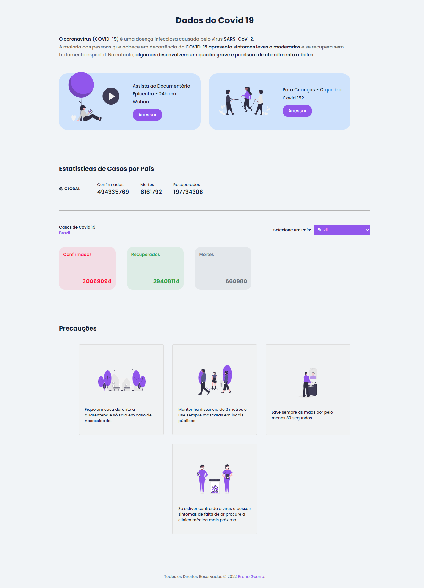

<h1 align="center">
    Covid 19 Data App
</h1>

<h4 align="center">
  Covid 19 Data App with React (ContextAPI) and Typescript.
</h4>

<p align="center">
  <a href="#technologies">Technologies</a>&nbsp;&nbsp;&nbsp;|&nbsp;&nbsp;&nbsp;
  <a href="#how-to-use">How To Use</a>&nbsp;&nbsp;&nbsp;|&nbsp;&nbsp;&nbsp;
  <a href="#links">Links</a>
</p>

<p align="center">
  
</p>

## Technologies

This project was developed for learning with the following technologies:

-   [ReactJS](https://reactjs.org/)
-   [styled-components](https://www.styled-components.com/)
-   [Axios](https://axios-http.com/ptbr/docs/intro)
-   [ContextAPI](https://pt-br.reactjs.org/docs/context.html)
-   [react-icons](https://react-icons.github.io/react-icons)
-   [VS Code][vc] with [ESLint][vceslint]

## How-To-Use

To clone and run this application, you'll need [Git](https://git-scm.com), [Node.js v16.14][nodejs] or higher + [Yarn v1.22][yarn] or higher installed on your computer. From your command line:

```bash
# Clone this repository
$ git clone https://github.com/brunorguerra/covid19-data-app

# Go into the repository
$ cd covid19-data-app

# Install dependencies
$ yarn install

# Run the app
$ yarn dev

# enter your browser and access
$ http://localhost:3000/
```

<!-- ## License -->
<!-- This project is under the MIT license. See the [LICENSE]() for more information. -->

---

## Links

-   Deploy on Vercel: https://covid19-data-app.vercel.app/
-   Repository: https://github.com/brunorguerra/covid19-data-app

Made with ♥ by Bruno Guerra [Get in touch!](https://www.linkedin.com/in/brunorguerra/)

[nodejs]: https://nodejs.org/
[yarn]: https://yarnpkg.com/
[vc]: https://code.visualstudio.com/
[vceslint]: https://marketplace.visualstudio.com/items?itemName=dbaeumer.vscode-eslint
